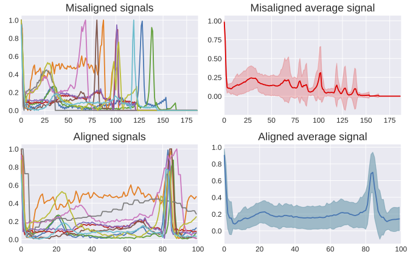

# AlignECG

Employing differentiable alignment to improve ECG classification.




## Preparation

Place data file ```train.csv``` and ```test.csv``` under the ```./data/``` folder.

Install the corresponding dependencies:

```bash
pip install requirements.txt
```

## Run the models

To run the model, using the 

```bash
python main.py --model {model} \
        --log_path {log_path} \
        --ckpt_path {log_path} \
        --epoch {epoch_num}  \
        --lr {learning_rate} \
        --batch_size {batch_size} \
        --seed {random_seed} \
        --align {align_point_len} \
        --inference 

```
- ```model```: The backbone model, select from ```[grufcn, trans, fcn, resnet, rescnn, gruatt, tcn]```
- ```align``` (opt.): The length of the aligned signal. If not set, no alignment is performed.
- ```inference``` (opt.): Conduct inference over ```./data/test.csv```.


   For more details, please refer to ```run.sh``` and ```main.py```.


## Acknowledgements

Part of the codes is reused from [tsai](https://github.com/timeseriesAI/tsai) and [DTAN](https://github.com/BGU-CS-VIL/dtan).

## License

Our code in this repository is licensed under the [MIT license](LICENSE).
